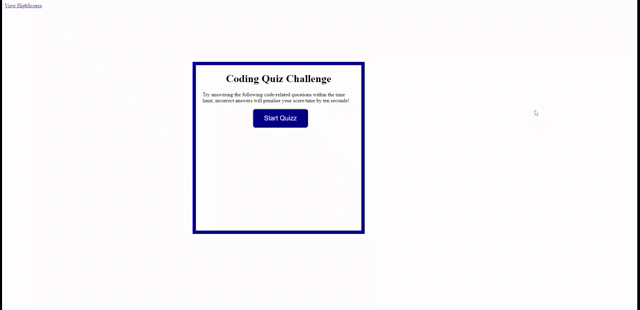

# Introduction

The deployed Webpage is a Quiz that displays the combine use of HTML, CSS, JavaScrip. The application is as simple as clicking on a start buton and you will be ask a series of questions about coding.

URL of the Web page:

file:///C:/Users/Tristan/Questions-Quiz/index.html

URL of my Repository:

https://github.com/TristanLibeau

# Functionality:

The homework was to create from scratch a website/quiz using mostly JavaScript. The test will start when click on the start button, at the same time a timer will start. You need to answer the questions correctly or you will have a penality by time deduction.

*   The Quiz start when I click on the start button and the timer start

*   Once a question has been answer you are presented with an other question

*   If you answer wrong to question you receive a penality of 10 seconds

*   The games end when all questions are answerd or the timer is down to 0

*   When the game is over you can register you score and you initials

# Mock-Up

This is a Gif of the expected behavior.

# Credits

*   w3schools.com
*   StackOverflaw
*   BootCamp Course

